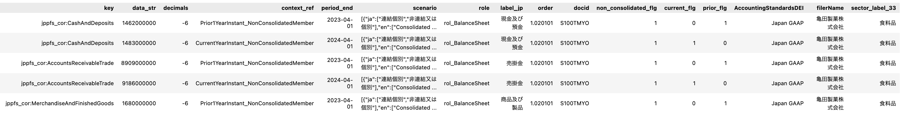

# edinet_xbrl_prep


このリポジトリについてはブログ「99から始める有価証券報告書XBRL分析」をご覧ください。  
Blog URL:

[99から始める有価証券報告書XBRL分析](https://norororo.hatenablog.com/entry/2024/12/20/081109)

このリポジトリを利用した分析例: 

https://github.com/nororo/edinet_xbrl_prep/blob/main/xbrl_analysis.ipynb

Google colaboratoryでも同様の分析例を公開しています。

[](https://colab.research.google.com/drive/1GiVRLKrQ5B5XtWN2bFYk73rKSXTBsptG?usp=sharing)


#### フロー
1. EDINET API（書類一覧API）で書類一覧を取得する
```python
res_results:EdinetResponseList = request_term(api_key=your_api_key, start_date_str='2024-06-15', end_date_str='2024-06-30')
```
2. EDINET API（書類取得API）で書類をダウンロード
```python
request_doc(api_key=your_api_key, docid=docid, out_filename_str=out_filename)
```
3. 共通タクソノミの取得
```python
account_list_common_obj_2024 = account_list_common(
    data_path=DATA_PATH, # download path
    account_list_year="2024"
)
```

4. 大福帳（One Big Table）の作成
```python
fs_tbl_df:FsDataDf = get_fs_tbl(
    account_list_common_obj=account_list_common_obj_2024,
    docid=docid, # document id (filename of downloaded zip file removed extension)
    zip_file_str=str(DATA_PATH / "raw/xbrl_doc" / (docid + ".zip")),# downloaded zip file
    temp_path_str=str(DATA_PATH / "raw/xbrl_doc_ext" / docid), # for temporal file
    role_keyward_list=fs_dict['BS']+fs_dict['PL']+fs_dict['report'], # filtered by role key
)
```



